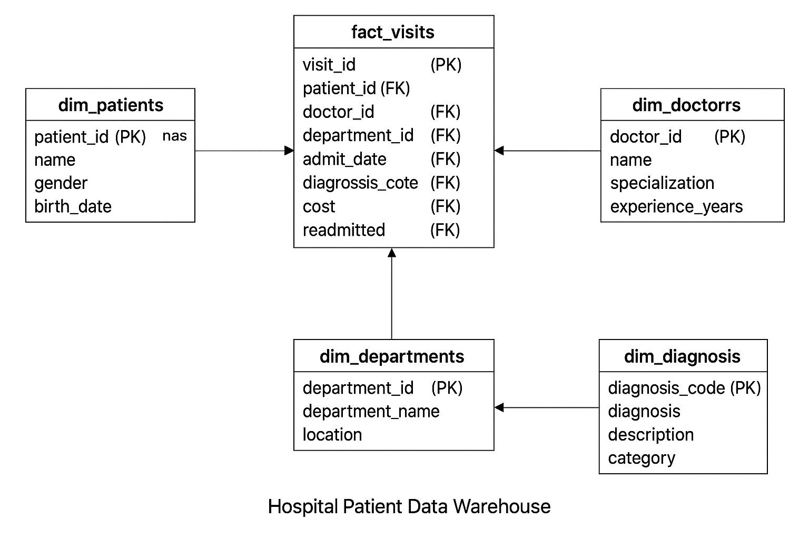

# 🏥 Hospita Data Warehouse

A data warehouse project designed to demonstrate SQL and data modeling skills. It follows a star schema structure to track and analyze hospital visit records, patient data, diagnoses, and readmission trends.

## 🚀 Project Objectives

- Design a dimensional model for healthcare data.
- Simulate hospital visit data using a **star schema**.
- Build a foundational warehouse for advanced analytics.
- Write SQL queries to derive insights on patient behavior, doctor performance, and readmission rates.

## 📎 Diagram

## 📌 Phases

✅ Phase 1 – Schema Design & Setup (Complete)  
⏳ Phase 2 – Sample Data Ingestion (Next)  
🔜 Phase 3 – Query Building & Insights  
📈 Phase 4 – BI Dashboard & Deployment (Optional)

## 🧱 Star Schema Design

### 📌 Fact Table: `fact_visits`
Captures core metrics related to patient hospital visits.

| Column          | Type         | Description                     |
|-----------------|--------------|---------------------------------|
| visit_id        | SERIAL (PK)  | Unique visit identifier         |
| patient_id      | INT (FK)     | Reference to the patient        |
| doctor_id       | INT (FK)     | Reference to the doctor         |
| department_id   | INT (FK)     | Department involved             |
| admit_date      | DATE         | Date of admission               |
| discharge_date  | DATE         | Date of discharge               |
| diagnosis_code  | VARCHAR(50)  | Code of diagnosis               |
| cost            | DECIMAL      | Total cost of treatment         |
| readmitted      | BOOLEAN      | Readmission flag                |

### 📌 Dimension Tables

#### `dim_patients`
Stores patient demographic information.

#### `dim_doctors`
Stores doctor details and specialization.

#### `dim_departments`
Stores department-level metadata.

#### `dim_diagnosis`
Stores diagnosis code, description, and category.

---

## 📊 Sample Use Cases

- Track average length of stay by department.
- Analyze readmission rates by diagnosis.
- Rank doctors by total cost billed.

---

## 🛠️ Tools Used

- PostgreSQL (or MySQL)
- SQL
- ER Diagram Tools (dbdiagram.io / DrawSQL)
- CSV (for loading sample data)

---

## 👨‍💻 Author

[**Aakaash M S**](https://github.com/msaakaash)